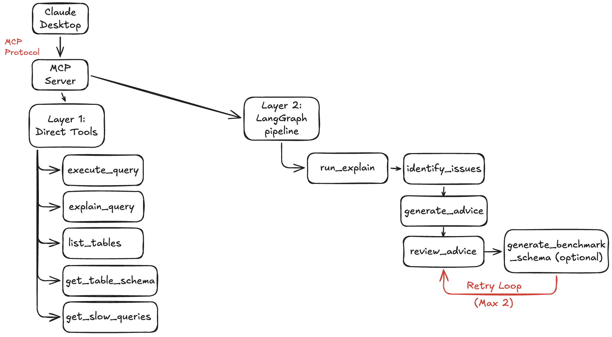
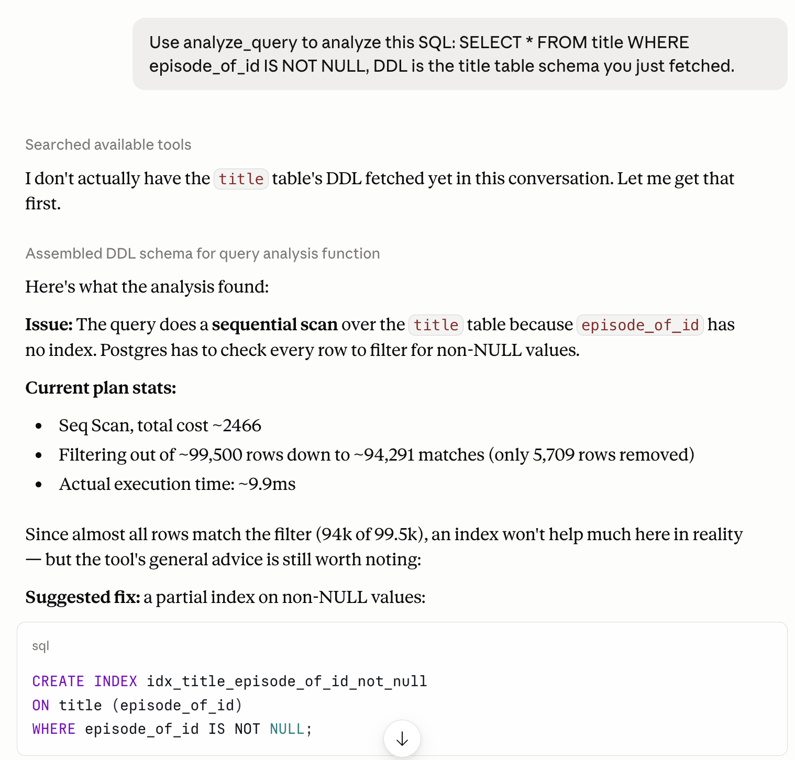
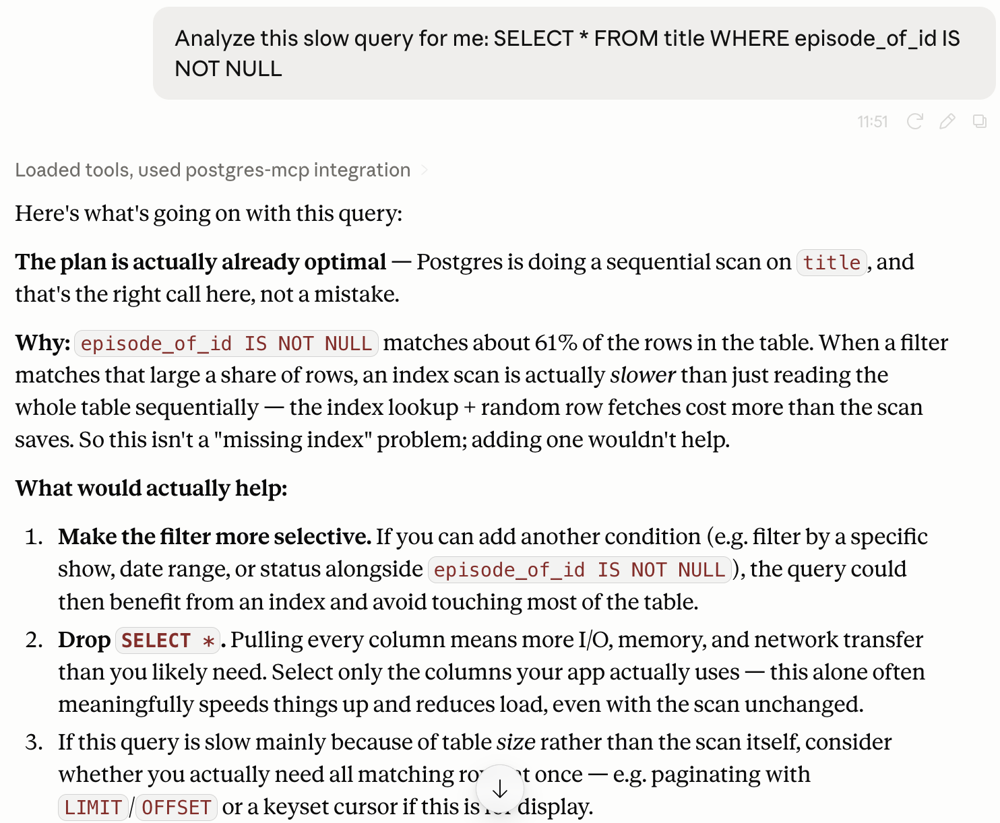

When I started this project, the goal was simple: wrap an existing SQL optimization pipeline so Claude Desktop could use it. What I ended up building was more than a tool wrapper — it's an MCP server that exposes a complete DBA workflow, including a LangGraph pipeline that not only generates optimization advice, but can reject its own recommendations when the evidence doesn't support them.

The project is [postgres-mcp](https://github.com/RachelHuangZW/postgres-mcp), an MCP server that connects Claude Desktop to a PostgreSQL database. It exposes six tools: from discovering what's in your database, to understanding slow queries, to finally running a full AI-powered optimization pipeline. This post is about the design decisions behind it and what I learned during the whole process.

## What is MCP?

MCP (Model Context Protocol) is a framework that lets Claude call external tools directly. Instead of building a web API that a human manually queries, you register tools with a name and description, and Claude decides when and how to use them based on the user's question.

The mental model I found most useful: MCP is like a restaurant menu. The AI is the customer — it reads the menu and orders what fits the situation. You're the kitchen. You don't decide what gets ordered; you make sure what's on the menu is accurate and what you serve is correct.

This changes how you think about tool design. The tool description isn't just documentation — it's the signal Claude uses to decide whether to call your tool at all.

## Why Two Layers?

The first design decision was how many tools to expose and at what level of abstraction.

I chose not to build a single `analyze_query` tool that accomplish everything. Instead, I built two layers:

**Layer 1 — Direct database tools:**
- `execute_query` — run arbitrary SQL
- `explain_query` — get the execution plan
- `list_tables` — discover what tables exist
- `get_table_schema` — inspect columns, types, and indexes
- `get_slow_queries` — pull historical slow query data from `pg_stat_statements`

**Layer 2 — AI pipeline:**
- `analyze_query` — run the full SQL-Surgeon LangGraph pipeline: EXPLAIN → identify issues → generate advice → review advice → optional benchmark

The reasoning: not every question needs the full AI pipeline. "What columns does this table have?" doesn't need a multi-step LangGraph agent. "Why is this query slow?" does. Giving Claude both layers means it can pick the right tool for the cost and complexity of the question.

Single "do everything" tools force the AI to always run the expensive path. Separate tools let Claude make the tradeoff itself — and let it discover what to look at (`list_tables`, `get_slow_queries`) before committing to the expensive one.

## The DDL Auto-Fetch Insight

The two-layer split solved cost. The next problem was friction inside Layer 2 itself.

`analyze_query` originally required the user to provide DDL (the `CREATE TABLE` schema) alongside the SQL. This created friction: users often don't have the DDL memorized, and asking them to copy-paste schema definitions breaks the conversational flow.

The fix was to make DDL optional and auto-fetch it when not provided:

```python
def analyze_query(sql: str, ddl: str = "", table_name: str = "") -> str:
    if not ddl:
        tables = _extract_table_names(sql)   # regex: FROM/JOIN → table names
        ddl = _fetch_ddl_for_tables(tables)  # information_schema.columns
    ...
```

But making the parameter optional wasn't enough. I discovered through real testing that Claude would sometimes choose to reason from its own knowledge rather than calling `analyze_query` — because its mental model of the tool still said DDL was required.

The fix was in the tool _description_, not the code:

> _"DDL is optional — the tool automatically fetches the schema for tables referenced in the query if not provided. Use this whenever the user asks for query optimization, regardless of whether they have the DDL handy."_

This taught me something important: **tool description is the UX of your tool.** The code defines what the tool does. The description defines when Claude decides to use it. They're equally important, but easy to treat as asymmetric.

## The Selectivity Bug — When the AI Catches a Bug in the AI

This is the most technically interesting part of the project, and it came from an unexpected source.

The underlying SQL-Surgeon pipeline uses a LangGraph evaluator-optimizer pattern: one node identifies issues, another generates advice, a third reviews the advice and either passes or requests a retry. Early testing worked well — until Claude Desktop, while presenting the tool's output to me, flagged a problem with its own response.

The tool had recommended adding a partial index on `episode_of_id IS NOT NULL`. Claude's response noted: _"since almost all rows match the filter (94k of 99.5k), an index won't help much here in reality."_

The AI using the tool had caught a bug in the AI inside the tool.

**The root cause:** The `identify_issues` node recognized "Seq Scan + no index" as a pattern and recommended an index. But it never checked _filter selectivity_ — what fraction of rows actually match the filter. When 95% of rows match `IS NOT NULL`, the Postgres planner will ignore an index and seq scan anyway. The data to make this judgment was already in the EXPLAIN output; the pipeline just wasn't using it.

The fix had two parts. First, parse selectivity from the EXPLAIN JSON:

```python
def extract_filter_selectivity(plan_json):
    actual = plan_json.get("Actual Rows", 0)
    removed = plan_json.get("Rows Removed by Filter", 0)
    if actual + removed == 0:
        return None
    return removed / (actual + removed)
```

Second, add an explicit rule to the analysis prompt:

> _"If a filter's selectivity > 0.3 (more than 30% of rows match), an index is likely unhelpful — the planner will prefer a sequential scan anyway."_

And a second gate in the review prompt to reject low-selectivity index recommendations before they reach the user.

**The result:** same question, asked to Claude Desktop before and after the fix.

<figure>



<figcaption>Before — the filter matches 94,291 of ~99,500 rows, and the tool says so, but still suggests <code>CREATE INDEX ... WHERE episode_of_id IS NOT NULL</code> anyway.</figcaption>

</figure>

<figure>



<figcaption>After — the tool correctly explains why a sequential scan is the right plan and redirects the conversation to the actual problem.</figcaption>

</figure>

Before, on an early test dataset (~99.5k rows), the tool flagged the low selectivity in its own explanation and recommended an index anyway. After the fix, on a larger dataset with a different selectivity ratio (~61%), the same rule correctly blocks the index recommendation instead.

This is the difference between a suggestion generator and an agent that can question whether the problem is being framed correctly. A good DBA doesn't just answer "how do I make this query faster?" — they sometimes push back with "should this query be asking for this much data at all?"

## What Real Testing Revealed

Two bugs only showed up during real Claude Desktop usage — not in any unit test.

**Bug 1 (fixed): Meta query pollution in `get_slow_queries`**

The first time I tested `get_slow_queries`, the top results were `CREATE EXTENSION pg_stat_statements` (21ms) and schema introspection queries — all generated by my own tools. The list was technically correct but practically useless for diagnosing application level performance.

Fix: filter out system queries (extension setup, schema introspection) by default, with an `include_system_queries=false` default parameter so the behavior can be overridden.

After the fix, the query list revealed the actual expensive application queries:

| Query | Mean time |
|-------|-----------|
| `SELECT * FROM title WHERE kind_id = $1 ORDER BY id` | 658ms |
| `SELECT * FROM title WHERE title ILIKE $1` | 116ms |
| `SELECT kind_id, COUNT(*) FROM title GROUP BY kind_id` | 85ms |

**Bug 2 (open): Schema hallucination**

The `generate_advice` node occasionally references column names that don't exist in the actual schema — for example, `tconst`, `primary_title`, and `start_year` from the IMDb public dataset, which share surface similarity with my test database. The LLM's training priors override the runtime DDL it was given.

This is a deeper architectural problem: the advice generation node needs structured validation that checks every referenced column against the provided DDL, with a retry on failure. It's tracked as an open issue and belongs to the SQL-Surgeon agent layer, not the MCP server layer.

## What I Learned

**MCP server design is about designing for composability, not designing isolated tools.** Individual tools are building blocks; Claude decides how to compose them at runtime, but only within the combinations my tool boundaries make possible. `get_slow_queries` → `analyze_query` is a workflow Claude can discover only because both tools exist and relate with each other.Designing each tool in isolation produces a feature list; designing the tool surface for composability produces a product.

**Tool descriptions are first-class code.** I spent more time tuning tool descriptions than I expected — and the impact was more visible than most code changes. When I updated `analyze_query`'s description to explicitly say DDL is auto-fetched, Claude's tool selection behavior changed immediately. This is a category of work that doesn't exist in traditional API development.

**LLM-based evaluators need structured features, not raw text.** The selectivity fix wasn't about adding more context to the prompt — the EXPLAIN JSON was already there. The fix was parsing the relevant signal into a number and adding an explicit rule about what to do with it. "The data was there" is not the same as "the model can use it."

## What's Next

Postgres-mcp is at v0.1.0 — feature-complete for its current scope. The open issue is the schema hallucination bug in SQL-Surgeon's advice generation node, which requires structured column validation at the pipeline level.

The next project is building an eval framework for SQL-Surgeon: a systematic way to measure whether the pipeline's advice is actually correct, not just syntactically valid. That's a harder problem, and the more interesting one.

If you're working on similar problems — MCP servers, LLM evals, or applied AI in enterprise contexts — I'd love to compare notes. Reach out via [GitHub](https://github.com/RachelHuangZW) or [email](mailto:zhiweih79@gmail.com).

---

_Code: [github.com/RachelHuangZW/postgres-mcp](https://github.com/RachelHuangZW/postgres-mcp)_
